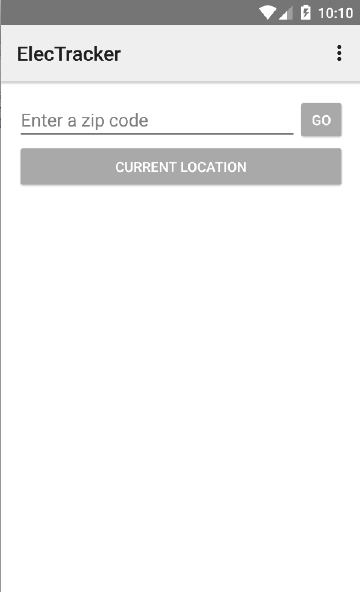
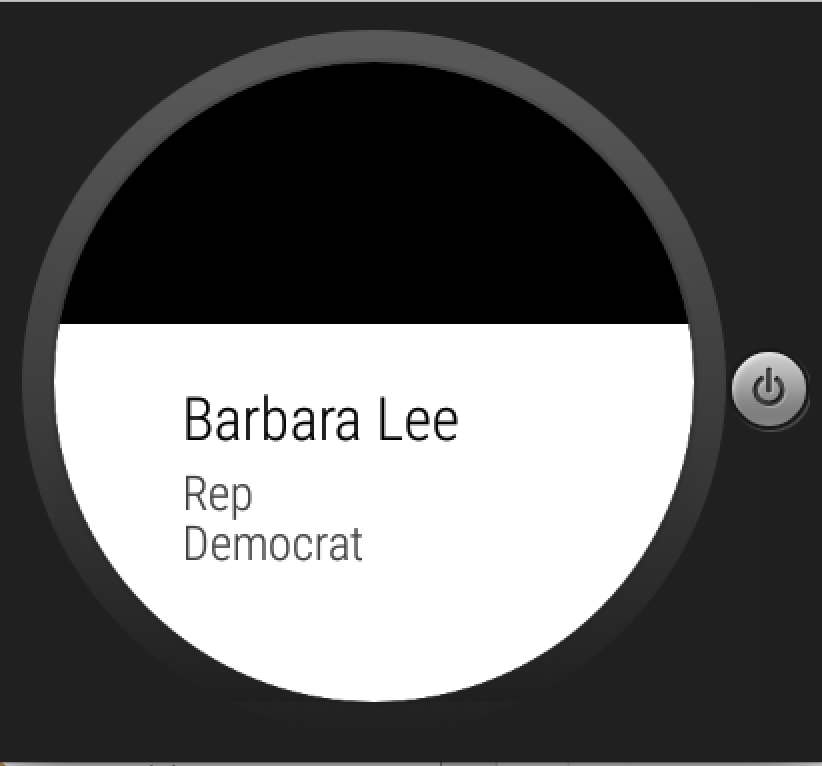
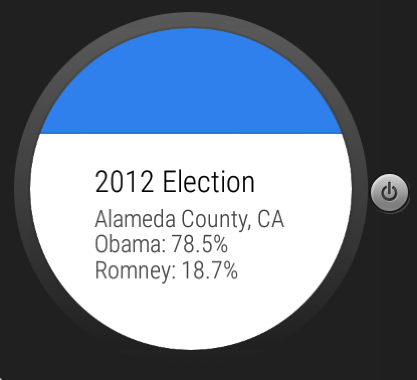

# PROG 02: ElectTracker!

My app is called ElecTracker.  It allows you to search the representatives and senators in a given zip code.  You can get your current location by tapping current location on the mobile view.  The app grabs the correct senators and representatives.  All of the API data is filled in correctly on both the phone and the watch.  There is a link provided for both the email and website of each representative.  It correctly displays the voting information of the county in the 2012 election.  You can randomly select a zip code to search on by shaking that watch.

## Authors

Neil Argade ([neilargade@berkeley.edu](mailto:neilargade@berkeley.edu))

## Demo Video

See [Barebones Overview -- 2B] (https://youtu.be/2ZmO9RLkOTU)
See [Final Project -- 2C] (https://youtu.be/qIZmzibUVNg)

## Screenshots

## Acknowledgments

* Jasper's code proved really useful.  If you examine my code, some of his code is commented out because I didn't have time to remove it.  I also pretty much just reused his code for the watch-phone communication.
* Thanks to StackOverflow for solving most of my problems.
